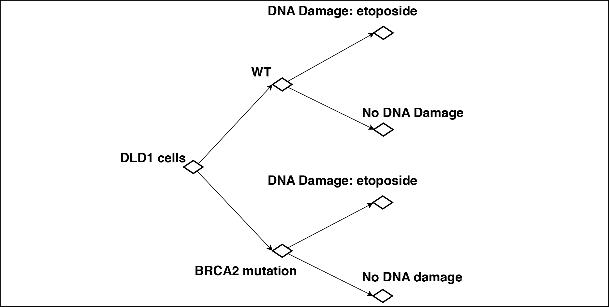
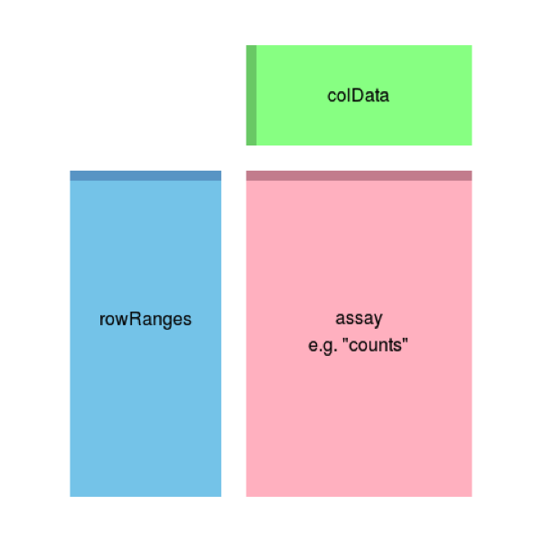

```{r setup, include=FALSE}
knitr::opts_chunk$set(echo = TRUE)
```

## RNA-seq Data

Now we’ll analyze some data from an experiment performed by your instructors. They took a DLD1 human colorectal adenocarcinoma cell line, and another version of the DLD1 cell line with a mutation in the BRCA2 gene. They treated these cells with a DNA damaging agent (etoposide). Here is a diagram of the experimental design:



There were two replicates of each condition, for a total of 8 samples. In the R exercises in here, you’ll cluster these samples to analyze the results of the experiment. Then, you’ll calculate differentially expressed genes[^1].

To open the code in this guide into your Editor Window, open this R Markdown file ("20.109_RNAseq_Analysis_Day7.Rmd"), or the more streamlined script ("DNAdamage_rnaseq_analysis.R").

[^1]: The following instructions are adapted from the RNA-seq workflow provided by Bioconductor, by Michael I. Love, Simon Anders, Vladislav Kim and Wolfgang Huber.

## Load Data

We’ll be using a tool from Bioconductor called DESeq2. We’ve done much of the pre-processing of the data for you. So you’ll need to load the Data into the Environment window, and load the required packages.
```{r message = FALSE, warning = FALSE}
load("~/Desktop/RNA-seq data analysis/preprocessed_data.RData")
library("DESeq2")
```

In preprocessing, the data from the sequencer was aligned to the human genome, and then assigned to genes based on known locations of genes in the genome. Now, we’ve loaded the counts of RNA-seq reads mapped to each gene into a specialized data structure called a DESeqDataSet. Here is what the DESeqDataSet object might look like: 
 


The assay (pink block) contains the matrix of counts of reads assigned to each gene in each of our 8 samples. The rowRanges (blue block) contains information about the genes (i.e. what genomic regions are assigned to each gene, how many exons are there, etc.) and the colData (green block) contains information about the samples.

We can investigate the DESeqDataSet, called “dds”, now that we’ve loaded the data into our environment, by looking at the counts, the phenotypic data about the samples in colData slot, and the data about the genes in the rowRanges slot.

```{r eval=FALSE}
dim(counts(dds))
head(counts(dds),3)
colSums(counts(dds))
colData(dds)
head(rowRanges(dds),1)
```

Write out in English what each command is telling R to do, and what you learned from the output. (Remember you can use "help()" to learn more about functions you are unfamiliar with). Notice that in the colData matrix, we have information about where each sample lies on our experimental design, and one column, “group” which contains all of the information about that sample.

## Clustering Samples

Now that we’ve gotten read counts per gene, we can use this to visualize and cluster our samples. First, we'll have to *transform* it. To transform data means to apply a mathematical function to every data point. For example, if you have data with a very large range of values, you might use a log transformation (take the logarithm of every data point) to make it easier to read on a graph, like in this example.


Clustering and principal components analysis (PCA), work best for data that generally has the same range of variance at different ranges of the mean values - meaning, genes with high read count values should have similar standard deviations to genes with low counts. For RNA-seq raw counts, however, the variance grows with the mean. For example, if one performs PCA directly on a matrix of read counts, the result typically depends only on the few most strongly expressed genes because they show the largest absolute differences between samples. 

As a solution, DESeq2 offers transformations for count data that stabilize the variance across the mean. One such transformation is the regularized-logarithm transformation or rlog. For genes with high counts, the rlog transformation will give similar result to the ordinary log2 transformation of normalized counts. For genes with lower counts, however, the values are shrunken towards the genes’ averages across all samples. The rlog-transformed data can be used directly for computing distances between samples and making PCA plots. The function rlog returns an object similar to our original DESeqDataSet object that contains the rlog-transformed values in its assay slot. This will take a few seconds to compute.

```{r message = FALSE}
rld = rlog(dds)
```

Here's a plot showing how our transformation changed our data. We've plotted the first sample against the second, first simply using the log2 function (after adding 1, to avoid taking the log of zero), and then using the rlog-transformed values. (Below you can also see the R code to create these plots, in case you're curious!)

```{r}
par( mfrow = c( 1, 2 ) ) #This line tells R we want two plots in one window, side by side
dds = estimateSizeFactors(dds) #For the log2 approach, we need to first estimate size
#factors to account for different number of total reads in each sample, known as 
#sequencing depth. Sequencing depth correction is done automatically for the rlog method.
plot(log2(counts(dds, normalized=TRUE)[,1:2] + 1), pch=16, cex=0.3)
plot(assay(rld)[,1:2], pch=16, cex=0.3)
```

We can see how genes with low counts (bottom left-hand corner) seem to be excessively variable on the ordinary logarithmic scale, while the rlog transformation compresses differences for the low count genes. You can learn more about the rlog transformation for RNA-seq data in the DESeq2 paper ([*link to paper*](https://genomebiology.biomedcentral.com/articles/10.1186/s13059-014-0550-8)).

Now we can cluster our samples. Like last time, we use the R function dist to calculate the Euclidean distance between samples. To ensure we have a roughly equal contribution from all genes, we use it on the rlog-transformed data. We need to transpose the matrix of values using t, because the dist function expects the different samples to be rows of its argument, and different dimensions (here, genes) to be columns.

```{r eval = FALSE}
library("pheatmap")
trld = t(assay(rld))
sampleDists = dist(trld, method = "euclidean")
pheatmap(sampleDists, labels_row=rownames(colData(dds)))
```

Save this image as a jpeg. How does the heatmap look to you? Is there anything encouraging about the reproducibility of this experiment in this heatmap?

Another way to visualize sample-to-sample distances is a principal components analysis (PCA), as we did in the last lab.

```{r eval = FALSE}
library("FactoMineR")
result = PCA(trld)
```
```{r eval=FALSE}
plot(result,choix="ind")
```

As you can see, with the huge data matrix and long sample names in real RNA-seq data, our previous method for running PCA makes really ugly graphs. Fortunately, DESeq2 created their own PCA function with this in mind. Since we’ve loaded the DESeq2 package, we can call this function.

```{r eval = FALSE}
plotPCA(rld, intgroup = c("group"))
```

The term specified by intgroup ("interesting group") is used for labeling the samples; they tell the function to use it to choose  colors. In our case, the column in our colData slot is simply called "group."

Save this image as a jpeg. How does the PCA compare to the distance heatmap?

##Clustering Genes

In the sample distance heatmap made previously, the dendrogram at the side shows us a hierarchical clustering of the samples. We could also do such a clustering with the genes. 
We will work with the rlog-transformed counts. The heatmap becomes more interesting if we do not look at absolute expression strength but rather at the amount by which each gene deviates in a specific sample from the gene’s average across all samples. Hence, we center each genes’ values across samples, and plot a heatmap. We provide a data.frame that instructs the pheatmap function how to label the columns. We'll remove gene names (there will be too many to read, anyways). R will take a couple of minutes to compute this one.

```{r figure.height=9, eval=FALSE}
library("genefilter")
mat = assay(rld)
mat = mat - rowMeans(mat)
df = as.data.frame(colData(rld)[,c("line","dnadamage")])
row.names(mat) = NULL
pheatmap(mat, annotation_col=df)
```

Save this figure. There are over 20,000 genes in the human genome, so our heatmap has over 20,000 rows. It's pretty hard to see what's going on in this big figure. Since we're interested in which genes are changing in our samples, let's instead select the 20 genes with the highest variance across samples.

```{r eval=FALSE, fig.height=8}
topVarGenes <- head(order(rowVars(assay(rld)), decreasing = TRUE), 20)
mat = assay(rld)[topVarGenes, ]
mat = mat - rowMeans(mat)
pheatmap(mat, annotation_col=df)
```

In the hierarchical clustering of these 20 genes, there are two big groups with different behaviors amongst the different samples. Describe what each group of genes is doing in our experiment.

## Differential Genes

Now that we’ve explored the distance between our samples and taken a look at some genes we are interested in, the next step is finding out which genes are significantly differentially expressed. We expect basically every gene to have a slightly different read count between samples. Cell-to-cell and experimental variation in gene expression almost guarantees it. DESeq looks for significantly differentially expressed genes based on our assigned groups by modeling the variance in gene expression among the whole group of genes, and looking for genes that differ by an amount greater than we would expect due to normal variability.

We’ll run the DESeq function on our (un-transformed) DESeqDataSet object to create this model. This function will print out a message for the various steps it performs. Briefly these are: the estimation of size factors (controlling for differences in the sequencing depth of the samples), the estimation of dispersion values (similar to variance) for each gene, and fitting a model to the data. This will take a couple of minutes.

```{r eval = FALSE}
dds = DESeq(dds)
```

 Now we can create a comparison between any of the groups. Let’s look at the difference caused by etoposide in BRCA2 mutant cells.

```{r eval = FALSE}
res = results(dds, contrast=c("group", "mutant etop","mutant none"))
summary(res)
```

The summary command will show you how many genes are significantly up- and down-regulated in that comparison. How many are there for each?

We can also take a look at the output of the results function itself to see gene-specific information.

```{r, eval = FALSE}
res
```

The results function will give you a data frame with information for each gene: a (normalized) mean expression value over all samples, a “log2 Fold Change” value which tells you how much the expression level changed by,  a p value, and more. Remember that a p value indicates the probability that a fold change as strong as the observed one, or even stronger, would be seen under the situation described by the null hypothesis – which is that there is no difference between these two treatment groups.

(Sometimes a subset of the p values in res will be NA (“not available”). This is DESeq’s way of reporting that all counts for this gene were zero, and hence no test was applied. In addition, p values can be assigned NA if the gene was excluded from analysis because it contained an extreme count outlier.)

In high-throughput biology, we are careful to not use the p values directly as evidence against the null, but to correct for multiple testing. Since we’re testing for over 20,000 genes, we need to use the adjusted p-value to minimize false positives in our list of differentially expressed genes.

So, if we consider a fraction of 10% false positives acceptable, we can consider all genes with an adjusted p value below 10% = 0.1 as significant. How many such genes are there?

```{r eval = FALSE}
sum(res$padj < 0.1, na.rm=TRUE)
```

## Annotation and gene enrichments

It’s not enough to know how many genes have changed between these samples, we want to know which genes they were. And, more precisely, what those genes do. We can find the gene with the lowest fold change:

```{r eval = FALSE}
head(res[ order(res$log2FoldChange), ])
```

What is the gene symbol for this gene? Is this gene up-regulated or down-regulated in DNA damaged cells compared to control? (Hint: look at the log fold change column, and click [*this link*](http://rstudio-pubs-static.s3.amazonaws.com/13988_bb11d85b79b2436280de434988558140.html) for an explanation of log fold change). Is this change statistically significant? Google this gene to find out what it does. Does this make sense in context of this experiment?

But there were thousands of significantly differentially expressed genes. We don't want to google every single one! We’ll rely on the extensive work that has been done in human biology. Most proteins’ functions have been investigated, and terms have been assigned to them to indicate what they are. This group of terms is called “Gene Ontology” (GO). For example, a gene that has been determined to encode a transcription factor might be assigned the term “GO:0001085 RNA polymerase II transcription factor binding”. 

We load the AnnotationDbi package and the human gene annotation package org.Hs.eg.db. We can use the mapIds function in the Annotation package to add individual columns to our results table. We provide the row names of our results table as a key, and specify that our gene names are Gene Symbols (as opposed to other IDs such as Entrez or Ensembl IDs). The column argument tells the mapIds function which information we want, and the multiVals argument tells the function what to do if there are multiple possible values for a single input value. Since many genes have more than one GO term assigned to them, we want a list of all of them.

```{r eval = FALSE}
library("AnnotationDbi")
library("org.Hs.eg.db")
res$go = mapIds(org.Hs.eg.db,
                 keys=row.names(res),
                 column="GO",
                 keytype="SYMBOL",
                 multiVals="list")
head(res)
```

You can see that a list of GO terms (represented by their numerical IDs) were assigned to each gene. Now, as when calculating differential genes, we need to apply statistical tests to these GO terms, to determine if there are terms that are associated with downregulated genes more often than we would expect by chance.

There are two types of tests we could apply to find this out. We’ll try both of them using the topGO package. To do this, we’ll need to construct yet another data structure, a topGOdata object. First, we’ll remove rows that have an adjusted p value of “N/A” from res, since topGO doesn’t handle those rows well. We'll further filter these genes into the ones that were downregulated relative to control. Then, to create a topGOdata object, we need a list of all of the genes along with their p values, and a function to select significant genes from that list (in our case, when the adjusted p value is less than 0.1).

```{r eval = FALSE}
library("topGO")
resslim = res[complete.cases(res$padj),]
resslimDown = resslim[resslim$log2FoldChange<0,]
GOdataDown = new("topGOdata", ontology = "BP",
             allGenes = setNames(resslimDown$padj, rownames(resslimDown)), 
             geneSel = function(allScore) {return(allScore<0.1)}, 
             nodeSize = 10, annot = annFUN.gene2GO, gene2GO = resslimDown$go)
```

Here, we’ve set the ontology we’re using to “BP”, or “biological process”, since we’re interested in what processes are being effected in the cells. NodeSize = 10 means that we’re going to ignore gene ontology terms that have less than 10 genes assigned to them (to speed things up), and in annot and gene2GO, we tell it where to find the mapping between genes and GO terms, in the res column we made called “go”.

Now, we can run our two statistical tests. The first is a Fisher’s exact test, which just looks at the number of significantly differentially expressed genes assigned to each GO term (ignoring the p value, it works even if you just supply it with a list of significant genes and no scores).

```{r eval = FALSE}
resultFisher = runTest(GOdataDown, algorithm = "classic", statistic = "fisher")
```

The second is Gene Set Enrichment Analysis, or the Kolmogorov-Smirnov test. This looks at the values of the gene scores (p values). For each set of genes assigned to a GO term, it calculates whether this set is enriched (i.e. found more often than by chance) in the genes with the highest or lowest scores.

```{r eval = FALSE}
resultKS = runTest(GOdataDown, algorithm = "classic", statistic = "ks")
```

We can compare these results by making a table of the top 10 GO terms by the GSEA method, and including the ranks of those GO terms in the Fisher method.

```{r eval = FALSE}
allResDown = GenTable(GOdataDown, classicFisher = resultFisher, 
                      classicKS = resultKS, orderBy = "classicKS", 
                      ranksOf = "classicFisher",topNodes = 10)
allResDown
```

Save your resulting GO table to a file. What kind of GO terms are significant in this comparison? What can we learn from this?

Finally, we want to save all the work we did in an RData object. This will save all of the objects we have listed in our R Environment right now, so we can load them into R later (like in a future lab!).

```{r eval = FALSE}
save.image("~/Desktop/RNA-seq data analysis/afterAnalysis.RData")
```

Bonus: Can you repeat the above analysis for upregulated genes, and see what kinds of genes were turned on by etoposide? What did we learn from that? Feel free to try out other contrasts, like untreated WT versus mutant cells as well.
